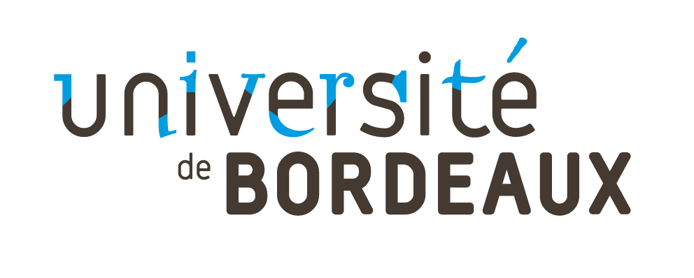

```@raw html
<div style="display: flex; justify-content: center; gap: 20px; align-items: center;">
  
  
  
</div>
```

```@raw html
<div style="text-align:center">
  <p style="font-weight:bold; font-size: 35px; font-variant: small-caps; margin: 0px">
    Master 2 : Biomedical MRI course
  </p>
</div>
```

Welcome to the *Master 2 : Biomedical MRI* course
offered by Aurélien Trotier at university of Bordeaux


## Goals
The goal of this website is to give you an advanced formation about MRI physics, pulse sequence development and reconstruction focused on reusable technical skills.

Lectures will be done by Professors and this website will be used to teach complementary and more specific knowledges about MRI topics.

After taking this class, you should be able to start your internship with a broad knowledge about MRI and associated coding skills that will make your life (as well as your supervisor) easier.

## Prerequisites
No knowledge of the Julia programming language is required: this course only assumes knowledge of common programming concepts like for-loops and arrays.

## Contents
### Lectures
The course is taught in 4 months and are seperated in Teaching Units (UE) :
- UE Technologie de l’IRM & Reconstruction d’images
- UE Mathématiques, Programmation (avancée) pour l’imagerie & Traitement/analyse d’image
- UE Instrumentation et dispositifs biomédicaux pour l’IRM
- UE Physiologie, physiopathologie et Imagerie des grandes fonctions physiologiques


Most of the topics of this website will cover the first 2 UE.

## FAQ

#### Why should I learn Julia?
Paraphrasing the [official website](https://julialang.org), 
Julia is: 
- **Fast:** designed for high performance computing, compiles to LLVM
- **Dynamic:** dynamically typed, interactive REPL
- **Reproducible:** great package manager, reproducible environments and pre-built binaries
- **Composable:** uses multiple dispatch
- **General:** allows async I/O, metaprogramming, etc.
- **Open source:** open development, uses permissive MIT license

If these are features that sound appealing to you, you should learn Julia!

#### How can I run the notebooks?
Running notebooks is described in the next section of the *Installation* notebook.

Alternatively, you can open the notebook on Binder by clicking *"Edit or run this notebook"*.
However, Binder can take a prohibitively long time to load. 
Pluto notebooks show an estimate of the loading times above the *"Run in Binder"* button.

If you are familiar with Git, you can also clone the [GitHub repository of this course](https://github.com/CRMSB/EDUC_BiDiM_IRM).
You can then open your local copy of the lectures and homework in Pluto.
Just make sure to regularly pull to keep your copy of the course up to date.

## Acknowledgements
The format of this website as well as the contents of this course are influenced by the following lectures:
- [*Julia for Machine Learning*](https://adrianhill.de/julia-ml-course/) 
  at TU Berlin by Prof. Klaus-Robert Müller
